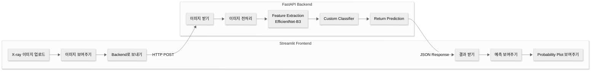

# finetuned-model-serving
2024-2 '딥러닝기반데이터분석' 강의 과제 2 'CNN Fine-tuning과 Serving'
## Chest X-Ray로 폐 질환 분류하기

]

## Model Serve
### Pipeline

```mermaid
---
config:
  theme: neutral
  look: neo
  layout: dagre
---
graph LR
subgraph Frontend[Streamlit Frontend]
A[X-ray 이미지 업로드] --> B[이미지 보여주기]
B --> C[Backend로 보내기]
H[결과 받기] --> I[예측 보여주기]
I --> J[Probability Plot 보여주기]
end
subgraph Backend[FastAPI Backend]
    D[이미지 받기] --> E[이미지 전처리]
    E --> F[Feature Extraction<br/>EfficientNet-B3]
    F --> G[Custom Classifier]
    G --> K[Return Prediction]
end
C -->|HTTP POST| D
K -->|JSON Response| H
```

### Demo

